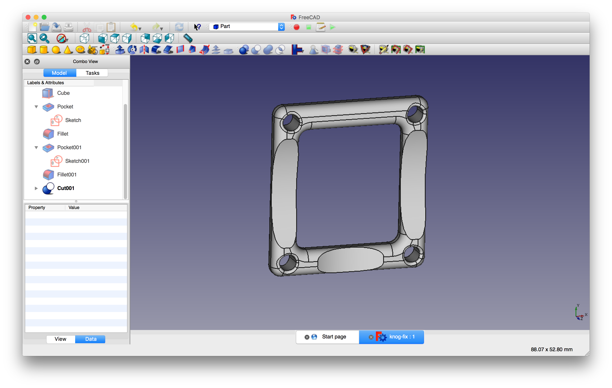
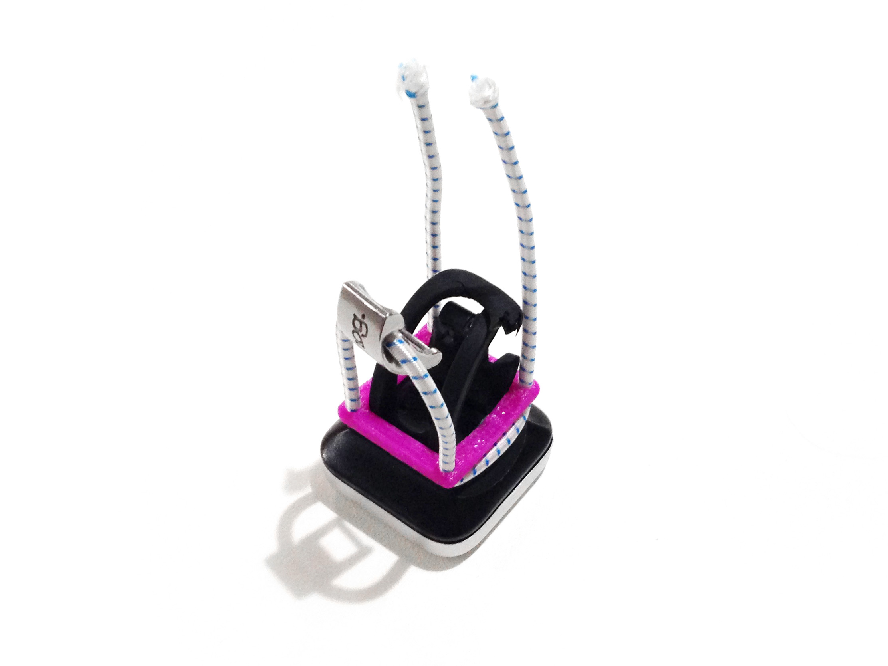

Knog Blinder silicon strap replacement
--------------------------------------

My [Knog Blinder 4](http://www.knog.com.au/bike/lights/be-seen-bike-lights/blinder-4.html) bike lights (which I love) have a weak point in the silicon strap right near the metal tensioner. 

Both of them broke there, so I've modelled up a frame to replace the silicon with some outdoor climbing [2mm static cord](http://www.soc.com.au/products/1643157/2193065) that's 50c a metre.

The 3D print file (.stl) was created with [FreeCAD](http://www.freecadweb.org).

Both the .stl and the .FCStd files are available here to print or edit.

You can also find them on [Thingiverse](http://www.thingiverse.com/thing:1562549) if that's your thing.

##Notes

* You might need to clean up the holes a little bit for the 2mm static cord to slip through easily.
* I printed the frame in PLA.

